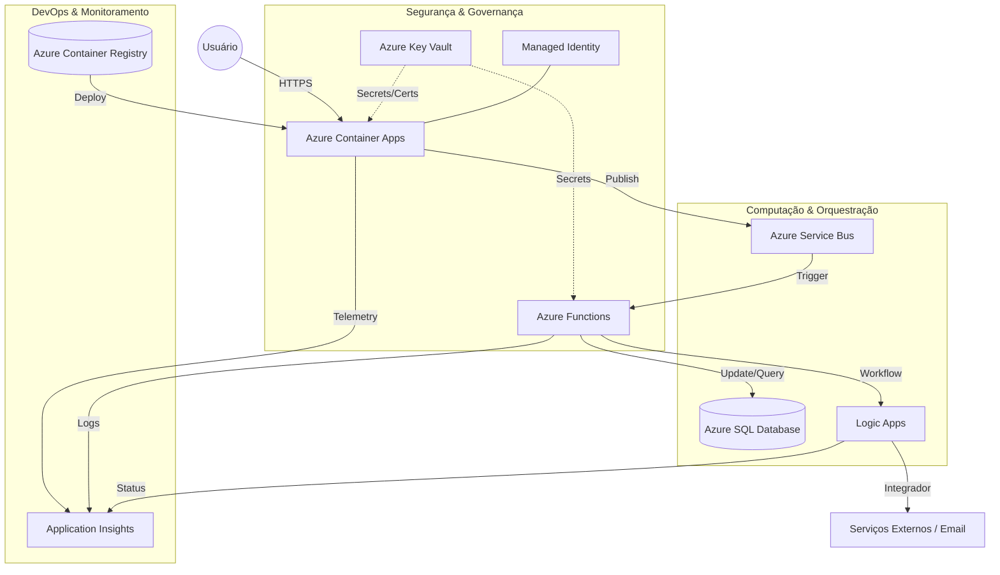

# 1. Título e Badges

Nesta seção, definimos a identidade do projeto e utilizamos *badges* para transmitir, de imediato, o status da infraestrutura e do deploy.


# [EXEMPLO DE PASSO A PASSO PARA IMPLEMENTAÇÃO DE SERVIÇOS NO AMBIENTE AZURE]: Solução Cloud-Native com Azure Ecosystem

> **Arquitetura de Microserviços e Orquestração Serverless**

[](https://portal.azure.com)
[](https://learn.microsoft.com/en-us/azure/azure-resource-manager/bicep/)
[](https://azure.microsoft.com/en-us/products/container-apps/)
[](https://opensource.org/licenses/MIT)
[](https://github.com/features/actions)

Este projeto demonstra uma implementação robusta e escalável utilizando o ecossistema **Microsoft Azure**, focando em desacoplamento de serviços, segurança de segredos e monitoramento de alta performance.


---


---

## 2. Visão Geral (Project Overview)

Esta seção contextualiza a aplicação, descrevendo o problema de negócio e a estratégia técnica adotada.

```markdown
## 2. Visão Geral

O **[Projeto]** é um exemplo de passo a passo para uma solução desenhada para estudar a implementação de serviços no ambiente Azure. 

Diferente de arquiteturas monolíticas tradicionais, este projeto utiliza uma abordagem **Cloud-Native**, aproveitando o poder da orquestração serverless e do desacoplamento por mensageria. A solução foi projetada para suportar alta disponibilidade, escalabilidade elástica e segurança rigorosa, garantindo que cada componente do ecossistema Azure desempenhe um papel específico e otimizado.

### Objetivos Principais de estudo:
* **Escalabilidade Elástica:** Garantir que o sistema responda a picos de demanda sem intervenção manual, utilizando KEDA em Container Apps.
* **Resiliência e Desacoplamento:** Utilizar filas e tópicos para assegurar que falhas em serviços secundários não interrompam o fluxo principal.
* **Segurança "Zero Trust":** Implementar o princípio de privilégio mínimo através de identidades gerenciadas (Managed Identities) e centralização de segredos.
* **Observabilidade de Ponta a Ponta:** Monitoramento granular de performance e rastreamento de requisições distribuídas.
```

---

## 3. Arquitetura da Solução

A aplicação foi estruturada seguindo os princípios de **Microserviços Event-Driven**, garantindo desacoplamento entre a recepção de dados e o processamento pesado.

### Diagrama de Arquitetura (Mermaid)



### Descrição do Fluxo de Dados

1.  **Entrada:** O tráfego chega via **Azure Container Apps**, que atua como o ponto de entrada (API/Web) escalável.
2.  **Segurança:** O Container Apps recupera strings de conexão e chaves de API do **Azure Key Vault** de forma segura via *Managed Identity*.
3.  **Assincronismo:** Requisições que exigem processamento intensivo são postadas no **Azure Service Bus** (Filas/Tópicos), liberando a API para novas requisições.
4.  **Processamento:** Uma **Azure Function** é disparada pelo Service Bus para processar a lógica de negócio e persistir os dados no **Azure SQL Database**.
5.  **Integração:** Caso o processamento exija uma integração complexa (ex: envio de e-mail ou integração com SAP/Salesforce), a Function invoca um **Logic App**.
6.  **Observabilidade:** Todo o tráfego e logs de erro são centralizados no **Application Insights** para rastreamento ponta a ponta.

### Justificativa da Escolha

* **Custo-Benefício:** O uso de *Serverless* (Container Apps e Functions) permite que a infraestrutura escale até zero quando não houver uso, otimizando os custos.
* **Resiliência:** O Service Bus garante que, mesmo sob carga extrema ou instabilidade no banco de dados, as mensagens não sejam perdidas.
* **Segurança:** A ausência de credenciais "hardcoded" no código, graças ao Key Vault e Managed Identities, eleva o nível de conformidade da solução.

---

## 4. Stack Tecnológica

A escolha das tecnologias baseou-se na necessidade de criar um ambiente escalável, resiliente e de baixa manutenção operacional (PaaS e Serverless).

| Categoria | Tecnologia | Papel na Arquitetura |
| :--- | :--- | :--- |
| **Cloud Provider** | Microsoft Azure | Hospedagem e serviços gerenciados. |
| **Compute** | Azure Container Apps | Orquestração de microserviços em containers. |
| **Serverless** | Azure Functions | Processamento orientado a eventos e triggers. |
| **Database** | Azure SQL Database | Persistência de dados relacional (PaaS). |
| **Messaging** | Azure Service Bus | Desacoplamento via filas e tópicos. |
| **Security** | Azure Key Vault | Gestão centralizada de segredos e certificados. |
| **Registry** | Azure Container Registry | Armazenamento privado de imagens Docker. |
| **Integration** | Azure Logic Apps | Orquestração de workflows e conectores externos. |
| **Monitoring** | Application Insights | Rastreamento distribuído e telemetria de APM. |
| **IaC** | Bicep / Terraform | Provisionamento de infraestrutura como código. |

### Linguagens e Frameworks (Exemplo)
* **Backend:** .NET 8 / Node.js (TypeScript) / Python (FastAPI).
* **Containerização:** Docker (Multi-stage builds para otimização de imagem).
* **Comunicação:** REST (HTTP/gRPC) e Mensageria Assíncrona.

---

## 5. Processo de Implementação (Deep Dive)

A implementação seguiu um ciclo de vida focado em automação e segurança, dividido nas seguintes etapas fundamentais:

### 5.1. Containerização e Registro (Docker & ACR)
O ciclo de vida da aplicação começa com a padronização do ambiente de execução:
* **Multi-stage Build:** Criação de `Dockerfiles` otimizados para reduzir a superfície de ataque e o tamanho das imagens.
* **Azure Container Registry (ACR):** Configuração de um registro privado com **Admin User desabilitado**, utilizando autenticação via Azure AD/RBAC.
* **Vulnerability Scanning:** Ativação do *Microsoft Defender for Containers* para análise estática de vulnerabilidades nas imagens enviadas.

### 5.2. Orquestração Serverless (Azure Container Apps)
Diferente do Kubernetes tradicional (AKS), optou-se pelo **ACA** para reduzir a sobrecarga operacional:
* **Environments:** Isolamento dos microserviços em um mesmo ambiente para facilitar a comunicação via *Internal Ingress*.
* **KEDA Scalers:** Implementação de auto-scaling baseado no tamanho das filas do Service Bus, permitindo escala até zero para otimização de custos.

### 5.3. Camada de Dados e Resiliência (SQL & Service Bus)
* **Azure SQL Database:** Provisionado no modelo *Serverless* com pausa automática. A conexão é protegida por Firewalls de VNet e autenticação via Identidade Gerenciada.
* **Service Bus (Standard/Premium):** Configuração de tópicos para o padrão *Publisher-Subscriber*. Implementação de **Dead Letter Queues (DLQ)** para garantir que nenhuma mensagem crítica seja perdida em caso de falha de processamento.

### 5.4. Processamento de Background (Azure Functions)
As Functions foram utilizadas para tarefas granulares e de baixo custo:
* **Triggers de Mensageria:** Escalonamento automático acionado pela chegada de novas mensagens no Service Bus.
* **Bindings:** Uso de *Output Bindings* para gravar dados diretamente no SQL ou Storage, reduzindo o boilerplate de código de conexão.

### 5.5. Automação de Workflows (Logic Apps)
Para integrações de baixo código e conectores de terceiros:
* **Orquestração de E-mail/CRM:** Uso do Logic Apps para disparar notificações de sucesso ou alertas de erro críticos para stakeholders externos, consumindo eventos gerados pelas Functions.

### 5.6. Segurança "Secretless" (Key Vault & Managed Identity)
A pedra angular da segurança deste projeto:
* **User-Assigned Managed Identity:** Atribuída aos Container Apps e Functions, eliminando a necessidade de armazenar senhas ou chaves em arquivos de configuração (`appsettings.json` ou `.env`).
* **Key Vault RBAC:** Centralização de segredos remanescentes (como chaves de APIs de terceiros) com acesso controlado estritamente via permissões de leitura para as identidades específicas dos serviços.

---

## 6. Monitoramento e Observabilidade

Para garantir a saúde operacional e a rápida resolução de incidentes, a solução utiliza a suíte do **Azure Monitor**, focada em três pilares: Métricas, Logs e Rastreamento.

### 6.1. Application Insights (APM & Tracing)
O Application Insights é o núcleo da observabilidade desta aplicação, fornecendo:
* **Distributed Tracing:** Rastreamento completo de uma requisição desde o Ingress no *Container Apps* até o processamento na *Azure Function* e a query final no *SQL Database*. Isso permite identificar gargalos exatos em fluxos assíncronos.
* **Application Map:** Visualização automática da topologia dos microserviços e suas dependências externas.
* **Live Metrics:** Monitoramento em tempo real do consumo de CPU, memória e taxa de falhas durante janelas de pico.

### 6.2. Log Analytics & Kusto (KQL)
Todos os logs de console (stdout/stderr) dos containers e as execuções das Functions são centralizados em um **Log Analytics Workspace**:
* **Consultas Avançadas:** Uso de *Kusto Query Language (KQL)* para correlacionar erros entre diferentes serviços.
* **Auditoria:** Registro de logs de acesso e modificações de recursos para conformidade de segurança.

### 6.3. Alertas e Dashboards
A proatividade é garantida através de configurações de alerta:
* **Smart Detection:** Alertas automáticos baseados em anomalias de performance (ex: aumento repentino na latência de resposta).
* **Availability Tests:** Testes de ping globais para garantir que os endpoints públicos estão acessíveis de diferentes regiões.
* **Service Bus Monitoring:** Alertas baseados no crescimento da *Dead Letter Queue*, permitindo ação imediata caso mensagens comecem a falhar sistematicamente.

> **Nota Técnica:** A integração é feita via SDK nativo, garantindo que o `Correlation-ID` seja propagado automaticamente entre o Service Bus e as Functions, mantendo a linhagem dos dados intacta.


---

## 7. Configuração do Ambiente de Desenvolvimento

Siga as instruções abaixo para configurar o ambiente local e começar a contribuir para o projeto.

### 7.1. Pré-requisitos
Certifique-se de ter as seguintes ferramentas instaladas:
* **Azure CLI:** Para interação com os recursos da nuvem.
* **Docker Desktop:** Necessário para o build e teste local de containers.
* **Visual Studio Code:** Sugerido com as extensões *Azure Tools*, *Bicep* e *Docker*.
* **SDKs:** [.NET 8 SDK](https://dotnet.microsoft.com/download) / [Node.js LTS](https://nodejs.org/) (ajuste conforme sua stack).
* **Azure Functions Core Tools:** Para rodar e testar as Functions localmente.

### 7.2. Autenticação no Azure
Antes de interagir com a infraestrutura, autentique sua sessão:
```bash
az login
az account set --subscription "NOME_DA_SUA_ASSINATURA"
```

### 7.3. Variáveis de Ambiente e Segredos
O projeto utiliza um arquivo de configuração local para emular os segredos que, em produção, residem no **Azure Key Vault**.

1. Copie o arquivo de exemplo:
   ```bash
   cp .env.example .env
   ```
2. Preencha as chaves no arquivo `.env` (ou `local.settings.json` para Functions):
   * `SqlConnectionString`: String de conexão com o banco (local ou dev).
   * `ServiceBusConnectionString`: Chave de acesso ao namespace do Service Bus.
   * `AzureWebJobsStorage`: Conta de armazenamento para execução das Functions.

### 7.4. Execução Local
Para rodar a aplicação completa via Docker Compose (emulando a orquestração):
```bash
docker-compose up --build
```

Para rodar apenas a **Azure Function** localmente:
```bash
cd src/MyFunction
func start
```

### 7.5. Emulação de Recursos (Opcional)
Para desenvolvimento totalmente offline, recomendamos o uso do **Azurite** (emulador de Storage) e **SQL Server Edge** via Docker para simular as dependências do Azure.


---

## 8. CI/CD Pipeline (GitHub Actions)

A automação deste projeto foi desenhada para garantir que nenhum código chegue ao Azure sem passar por validações de qualidade e segurança. Utilizamos o **GitHub Actions** integrado nativamente ao **Azure Container Registry (ACR)**.

### Estrutura do Workflow
O pipeline de entrega contínua está dividido em três estágios lógicos:

1. **Integração Contínua (CI):**
   - **Test & Lint:** Execução automatizada de testes unitários e análise estática de código.
   - **Docker Build:** Geração da imagem utilizando *multi-stage builds* para garantir um artefato final leve e seguro.
   - **Análise de Vulnerabilidades:** Scan da imagem em busca de dependências comprometidas antes do push.

2. **Gestão de Artefatos:**
   - **Push para o ACR:** A imagem é tagueada com o `GITHUB_SHA` (para rastreabilidade) e a tag `latest`.
   - **Retenção:** Política de limpeza automática de imagens antigas para otimização de custos de armazenamento no Azure.

3. **Entrega Contínua (CD):**
   - **Deploy para Container Apps:** Atualização da revisão do **Azure Container App** via `azure/container-apps-deploy-action`. Utilizamos o modelo de *Blue-Green deployment* (ou múltiplas revisões) para evitar downtime.
   - **Functions Deploy:** Publicação do pacote da **Azure Function** via *Zip Deploy* ou imagem de container, dependendo da configuração.

### Autenticação Segura (OIDC)
Para elevar o nível de segurança, este projeto não utiliza senhas estáticas (`Service Principal Secrets`). Em vez disso, implementamos o **OpenID Connect (OIDC)**:
* O GitHub solicita um token de curta duração ao Azure AD (Entra ID).
* O Azure valida a identidade do repositório e permite o deploy sem a necessidade de armazenar credenciais de longa duração nos segredos do GitHub.

### Trecho de Configuração (.yml)

# Exemplo simplificado de Deploy para Container App
- name: Build and deploy Container App
  uses: azure/container-apps-deploy-action@v1
  with:
    appSourcePath: ${{ github.workspace }}
    acrName: ${{ secrets.ACR_NAME }}
    containerAppName: ${{ secrets.CONTAINER_APP_NAME }}
    resourceGroup: ${{ secrets.RESOURCE_GROUP }}
    imageToDeploy: ${{ secrets.ACR_NAME }}.azurecr.io/web-app:${{ github.sha }}


---

## 9. Governança e Custos

A gestão eficiente de recursos no Azure é garantida através de políticas de organização lógica e monitoramento financeiro rigoroso, evitando o "Cloud Sprawl" (desperdício de recursos).

### 9.1. Estrutura de Resource Groups
Os recursos são agrupados por ciclo de vida e ambiente, facilitando a delegação de permissões (RBAC) e a limpeza de ambientes de teste:
* `rg-projectname-prod-001`: Recursos de produção (Container Apps, SQL).
* `rg-projectname-shared-001`: Recursos compartilhados (Container Registry, Key Vault).

### 9.2. Estratégia de Tagging
Todos os recursos recebem etiquetas obrigatórias para rastreamento de custos e automação:
* `Environment`: (Dev, Staging, Prod).
* `Project`: Nome do sistema.
* `Owner`: Time responsável.
* `CostCenter`: Unidade de negócio para faturamento.

### 9.3. Otimização de Custos (FinOps)
A arquitetura foi desenhada para ser **Cost-Efficient**:
* **Scale-to-Zero:** O Azure Container Apps e as Functions estão configurados para escalar até zero instâncias durante períodos de inatividade, eliminando custos de computação ociosa.
* **SQL Serverless:** O banco de dados utiliza a camada Serverless com pausa automática após 1 hora de inatividade.
* **Azure Advisor:** Revisão periódica das recomendações do Advisor para redimensionar recursos (right-sizing) e reservar instâncias se necessário.

### 9.4. Orçamentos e Alertas
* **Azure Cost Management:** Configuração de *Budgets* com alertas automáticos via e-mail quando o consumo atinge 50%, 75% e 90% da cota mensal prevista.
* **Quotas:** Limites de CPU e Memória definidos nos Container Apps para evitar gastos inesperados por loops infinitos ou ataques de negação de serviço.

---
